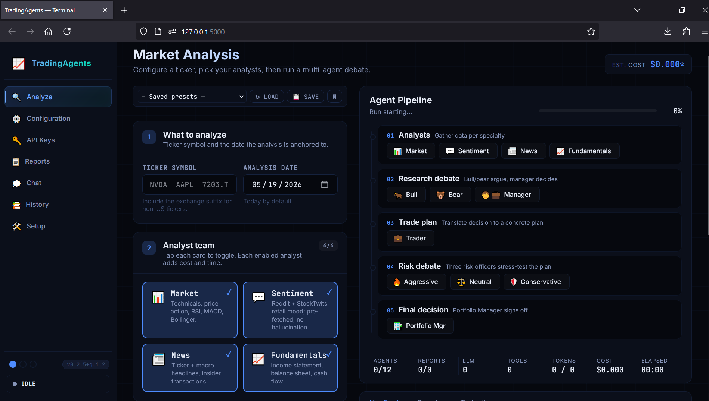

# TradingAgents-GUI

A polished local web GUI on top of [TauricResearch/TradingAgents](https://github.com/TauricResearch/TradingAgents), the multi-agent LLM trading framework. Designed so anyone can run a full multi-agent analysis on their own laptop — install once, then click a single script to launch.

**Fork of** [TauricResearch/TradingAgents](https://github.com/TauricResearch/TradingAgents) · **This repo**: [TheLocalLab/TradingAgents-GUI](https://github.com/TheLocalLab/TradingAgents-GUI) · **Tracks upstream v0.2.5**

> **Educational software. Not financial advice. LLMs hallucinate — verify every claim before trading on it.**



---

## What you get

Tracks upstream **TradingAgents v0.2.5**, then adds:

| Feature | Notes |
| --- | --- |
| **Polished Analyze tab** | Numbered-step form, larger inputs, segmented Depth + Report-Length controls, live cost estimate. |
| **Report-length control** | Three modes (Concise / Standard / Comprehensive) — injects a directive into every agent prompt to control how verbose the saved report is. Save tokens on a "Concise" run. |
| **Visual pipeline** | Vertical stages with real progress bars; agents show pending / in-progress / completed / errored. |
| **Tabbed output area** | Live Feed, Reports preview, Tool calls — each in its own pane with proper breathing room. |
| **Final decision card** | Color-coded (BUY / SELL / HOLD) with one-click copy. |
| **Reports tab redesign** | 3-pane: searchable index, table of contents, reader. Re-run with one click, export `.md` / `.html` / `.pdf`, delete from the UI. |
| **Live Health/Setup tab** | Replaces the static "instructions" tab. Diagnostics for Python version, deps, key configured, results dir writable, disk space, optional PDF support. |
| **First-run wizard** | Auto-opens when no provider key is set: pick a provider, paste a key, test it, you're done. |
| **Chat tab** | Multi-session chat with any provider you have a key for; pin past reports as grounding context; live token-counter with context-window warning. |
| **Theme system** | Three built-in themes: **Terminal** (default, blue neon), **Modern** (clean cyan), **Bloomberg** (black + amber/green, mono-heavy). Persists in localStorage. |
| **Real Stop / Cancel** | Backend supports cooperative cancellation via a `threading.Event`. The Stop button actually works. |
| **Live-run pill** | Visible from any tab. Shows the in-flight ticker and current agent. Click to jump back to Analyze. |
| **Browser notifications** | Notification (or in-tab banner fallback) when a run completes. |
| **Dual-region providers** | Qwen-CN, GLM-CN, MiniMax-CN are now first-class — no more hardcoded provider list. |
| **Cleaner backend** | Refactored from one 817-line `app.py` into focused modules (`agent_map.py`, `providers.py`, `env_store.py`, `run_manager.py`, `chat.py`, `stats.py`). |

The framework itself (agents, prompts, dataflows) is **unchanged from upstream** — this fork is a wrapper, not a re-implementation.

---

## Prerequisites

- **Python 3.10 or newer** (3.11 recommended)
- **Git** (only if you're cloning manually — the one-click installer handles this)
- An API key for at least one LLM provider (OpenAI, Anthropic, Google, OpenRouter, DeepSeek, xAI, Qwen, GLM, MiniMax, or local Ollama)

Don't have Python? The **one-click installer below** ships its own Python 3.11 (via portable Miniconda) and Git — nothing else to install.

## Quickstart

### Zero-install (Windows) — recommended for new users

Download [`TradingAgents-GUI-OneClick.bat`](TradingAgents-GUI-OneClick.bat), drop it in an empty folder, double-click it. It installs portable Git + Miniconda + Python 3.11, clones the repo, installs dependencies, and creates `start_WebUI.bat` for future launches. Safe to re-run (skip-if-exists at every step).

### Manual install — if you already have Python 3.10+

**Windows**

```bat
install.bat
```

**macOS / Linux**

```bash
./install.sh
```

This creates a `.venv/` in the project folder and installs the framework plus GUI dependencies. Takes ~1 minute the first time.

### Launching (after install)

**Windows**

```bat
start.bat
```

**macOS / Linux**

```bash
./start.sh
```

Open [http://localhost:5000](http://localhost:5000) in your browser. The first-run wizard will guide you through pasting an API key.

> **Why are install and start separate?** Because you only need to install once. Subsequent launches are instant — `start` is just a thin wrapper around `python -m gui.app`. If you forget and run `start.bat` first, it tells you to run `install.bat` instead.

### Docker

```bash
docker compose up
```

Then open [http://localhost:5000](http://localhost:5000). Reports persist in `./results/`.

For local Ollama:

```bash
docker compose --profile ollama up
```

---

## Setting up your first run

1. **Open the GUI** — the launcher does this for you.
2. **Setup wizard** — appears automatically. Pick a provider, paste a key, click **Test connection**.
3. **Type a ticker** on the Analyze tab (e.g. `AAPL`).
4. **Pick analysts** (cards toggle on click) and a **report length** (Concise saves money).
5. Click **Run analysis**. The pipeline lights up; live stats tick at the bottom.
6. When it's done, the green decision card shows the verdict. Reports auto-save under `~/.tradingagents/logs/<ticker>/<date>/`.

> First run on a ticker can take **5–20 minutes** depending on model and analyst selection. Cached runs are faster.

---

## Configuration

Three places to know about:

| Where | What |
| --- | --- |
| `.env` (project root) | API keys, provider/model defaults. Managed from **API Keys** tab in the UI. |
| `~/.tradingagents/` | Cache, reports, persistent memory log — created automatically. |
| `~/.tradingagents/chat/` | Chat session JSON files (multi-session storage). |

Provider env-vars the GUI sets (also editable by hand):

```bash
TRADINGAGENTS_LLM_PROVIDER=openai
TRADINGAGENTS_DEEP_THINK_LLM=gpt-5.4
TRADINGAGENTS_QUICK_THINK_LLM=gpt-5.4-mini

OPENAI_API_KEY=sk-...
ANTHROPIC_API_KEY=sk-ant-...
GOOGLE_API_KEY=...
# (one row per provider — see Models & Keys tab)
```

### Report length

In the **Analyze** form, the **Report length** segmented control picks:

| Mode | Behavior |
| --- | --- |
| **Concise** | Each agent is told to aim for ~300 words. Compact tables. Saves ~50% tokens vs. Standard. |
| **Standard** | Current default behavior — no extra instruction. |
| **Comprehensive** | Each agent is told to be thorough, multi-row tables, long-form. Best for serious research; costs more. |

Implementation: a single `get_brevity_instruction()` helper in `tradingagents/agents/utils/agent_utils.py` appends a directive to every agent's system prompt based on `config["report_brevity"]`. Touches all 12 agents (analysts + researchers + trader + risk + portfolio).

---

## Themes

Three dots in the lower-left of the sidebar:

- **Terminal** — blue neon, finance-terminal aesthetic (default).
- **Modern** — cleaner cyan, softer corners, less glow.
- **Bloomberg** — black + amber/green, mono-heavy, sharper corners, uppercase headers.

Saved in `localStorage` per browser.

---

## CLI still works

The upstream CLI is fully preserved:

```bash
.venv\Scripts\python.exe -m cli.main     # Windows
.venv/bin/python -m cli.main             # macOS / Linux
```

Or after installing, the entry-point scripts work too:

```bash
tradingagents          # original interactive CLI
tradingagents-gui      # this fork's GUI (same as start.bat / start.sh)
```

---

## Troubleshooting

| Symptom | Fix |
| --- | --- |
| `start.bat` says "no virtual environment" | Run `install.bat` first. |
| Browser doesn't open | Manually visit `http://127.0.0.1:5000`. |
| "No API key set" in Setup tab | Open **API Keys** tab, paste a key, click Save. The first-run wizard does this too. |
| Run hangs at the first analyst | Almost always a bad key or network/proxy block. Use the **test** button next to your key. |
| `PDF export needs weasyprint` | PDF is opt-in: `pip install -e ".[pdf]"` (or rerun `install.bat` after adding `[pdf]` to deps). MD and HTML always work. |
| Tokens or context "$0" | Pricing only published for major providers. The estimator is informational, not a billing system. |
| Want to expose to LAN | `start.bat --host 0.0.0.0`. **Do not expose to the public internet** — no auth layer. |
| Where are my reports? | `~/.tradingagents/logs/<ticker>/<date>/reports/complete_report.md`. The **Reports** tab is a viewer for that folder. |

---

## Upstream compatibility

This fork (version `0.2.5+gui.2`) is rebased on **upstream v0.2.5**. The `+gui.2` is a PEP 440 "local version identifier" — pip / setuptools recognise it as "upstream 0.2.5 with local modifications."

Notable v0.2.5 upstream changes baked in:

- **Sentiment Analyst redesign** — replaces the old `social_media_analyst`. Pre-fetches Reddit + StockTwits data instead of letting the LLM tool-call (kills a class of hallucinations).
- **Dual-region providers** — Qwen, GLM, and MiniMax each have international and China endpoints with separate keys.
- **Remote Ollama** — `OLLAMA_BASE_URL` lets the framework hit an Ollama instance on another machine.
- **Auto-key-detection** — providers advertise which env var holds their key.

I plan to keep this fork rebased on upstream as it evolves. The GUI deliberately lives in its own `gui/` package so upstream changes are easy to absorb.

---

## Architecture

```
TradingAgents-GUI/
├── tradingagents/                ← upstream framework, untouched
│   └── agents/utils/agent_utils.py   ← (one helper added: get_brevity_instruction)
├── cli/                          ← upstream CLI, untouched
├── gui/                          ← this fork's GUI
│   ├── app.py                    ← Flask routes
│   ├── run_manager.py            ← Concurrent runs, cancellation, event fan-out
│   ├── chat.py                   ← Multi-session chat with pinned reports
│   ├── env_store.py              ← Atomic .env IO with safe masking
│   ├── agent_map.py              ← Agent / team / report-section canonical metadata
│   ├── providers.py              ← Provider catalog driven by upstream api_key_env
│   ├── stats.py                  ← Token pricing + cost estimator
│   ├── templates/index.html      ← Single-page UI
│   └── static/
│       ├── css/style.css         ← Themes + all component styles
│       ├── js/app.js             ← Original tab/event logic
│       └── js/app_v2.js          ← Phase-4-onward redesign hooks
├── install.bat  / install.sh     ← One-time environment setup
├── start.bat    / start.sh       ← Launch the GUI (refuses if no .venv)
├── Dockerfile                    ← For containerized deployment
└── docker-compose.yml
```

**Transport:** REST for stateless reads / writes, Server-Sent Events for live run output and chat streaming.

**Concurrency:** runs execute on background threads (the graph is synchronous). Cancellation is cooperative via a `threading.Event` polled between graph chunks.

---

## Credits

- Original framework: [TauricResearch/TradingAgents](https://github.com/TauricResearch/TradingAgents) — all the heavy thinking lives there.
- This fork's GUI is maintained as a long-running personal fork; not aiming for an upstream merge.

## License

Same as upstream — see [LICENSE](LICENSE).

---

## About — The Local Lab

Maintained by **The Local Lab**. Tune in for the best available AI tools, made easy.

- 🎥 **YouTube** — [youtube.com/@TheLocalLab](https://www.youtube.com/@TheLocalLab)
- 💬 **Discord** — [discord.gg/5hmB4N4JFc](https://discord.gg/5hmB4N4JFc) — community chat, support, and feedback
- 💖 **Patreon** — [patreon.com/cw/TheLocalLab](https://www.patreon.com/cw/TheLocalLab) — exclusive one-click Windows installers, ComfyUI workflows, and AI resources. Skip the manual node + model setup and get straight to creating.
- 🐦 **X** — [@TheLocalLab_](https://x.com/TheLocalLab_)
